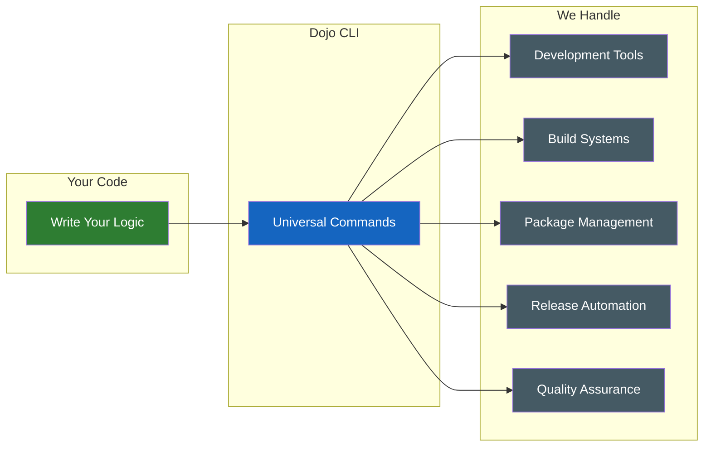

<div align="center">

# 🚀 Dojo Core CLI ⛩️


**Dojo** — A focused place to practice your craft and ship your work.

[](https://www.python.org/downloads/)
[](https://github.com/psf/black)
[](https://github.com/astral-sh/ruff)
[](https://github.com/python/mypy)
[](https://opensource.org/licenses/MIT)

### **🎓 The Best CLI Framework for AI Developers, Researchers & Students**

**We handle your build environment, so you can focus on your core responsibility.**

Stop wrestling with boilerplate. Start shipping features. Dojo Core CLI is the production-ready foundation that lets AI developers, researchers, and students concentrate on what matters: **their actual project**.

[Quick Start](#-quick-start) • [Features](#-features) • [Architecture](#-architecture) • [Commands](#-command-showcase) • [Documentation](#-documentation)

</div>

---

## 🎯 Why Dojo Core CLI?

### 🎓 Perfect for ALL Developers

**Tired of juggling build tools?** Whether you're developing in C/C++, Rust, TypeScript, Python, or any language - let Dojo Core CLI be your universal command center.

**No more:**
- ❌ `npm run dev`, `npm run build`, `npm run test` confusion
- ❌ Makefiles scattered everywhere with cryptic targets
- ❌ Bash scripts you wrote 6 months ago and can't debug
- ❌ Different commands for every project
- ❌ "Wait, how do I build this again?"

**Just ONE consistent interface:**
```bash
cli build all      # Build your C++, Rust, TypeScript - anything!
cli test          # Run tests for ANY language
cli dev all       # Format, lint, typecheck - universal
cli release       # Ship it, no matter what "it" is
```

### 🚀 For AI Developers & Researchers

Whether you're building ML pipelines, research tools, or data processing utilities, stop wasting time on CLI infrastructure.

Dojo Core CLI is a **batteries-included CLI template** that provides:

- ✅ **Universal Build System** - One CLI to rule them all (C++, Rust, Python, JS, anything!)
- ✅ **Zero Configuration** - Works instantly, no setup headaches
- ✅ **Production Ready** - Type-safe, tested, documented from day one
- ✅ **Best Practices Built-In** - Linting, formatting, testing - all configured
- ✅ **Language Agnostic** - Wrap ANY build tool, ANY language, ONE interface
- ✅ **Focus on Your Code** - We handle the DevOps, you handle the innovation

## 🚀 Quick Start

Get up and running in less than 60 seconds:

```bash
# 1. Clone the template
git clone https://github.com/neekware/DojoCoreCLI.git my-awesome-cli
cd my-awesome-cli

# 2. Customize your project (edit commands/config.py)
# Set PROJECT_NAME = "MyAwesomeCLI"

# 3. Setup and activate
./setup.sh
source .venv/bin/activate

# 4. Start using your CLI!
cli --help
cli proj info
cli dev all
```

That's it! You now have a fully functional CLI with development tools, testing, and documentation.

## 💡 Developer Experience Features

### 🔮 Intelligent Command Completion

**Never remember command flags again!** Full bash/zsh/fish completion that actually works:

```bash
cli bu<TAB>            # → cli build
cli build --<TAB>      # Shows ALL available options
cli dev t<TAB>         # → cli dev test, cli dev typecheck
```

- **Auto-discovers** all your commands and options
- **Context-aware** suggestions based on what you're typing
- **Works everywhere** - bash, zsh, fish, even in SSH sessions
- **Zero config** - installs automatically with `./setup.sh`

### 🤖 CI/CD Ready - Non-Interactive by Design

**GitHub Actions? Jenkins? GitLab CI?** We've got you covered:

```yaml
# That's it. No complex setup. It just works.
- run: |
    ./setup.sh -y        # Non-interactive mode
    source .venv/bin/activate
    cli dev all          # Run all checks
    cli build --all      # Build everything
    cli test             # Test everything
```

- **Exit codes that make sense** - 0 for success, non-zero for any failure
- **Structured output** - Parse-friendly for your CI pipelines
- **Quiet modes** - `--quiet` for minimal output, `--verbose` for debugging
- **No interactive prompts** - Everything can be automated
- **Docker-friendly** - Works perfectly in containers

### 🔄 Universal Command Interface

**One CLI, Any Language, Any Tool:**

```bash
# Instead of remembering:
# make build && npm run build && cargo build && go build
# Just:
cli build all

# Instead of:
# pytest && npm test && cargo test && go test
# Just:
cli test

# Instead of:
# black . && ruff check && prettier --write && cargo fmt
# Just:
cli dev format
```

Your team will thank you. Your future self will thank you.

## 🏗️ Architecture

<div align="center">



### 🎓 **Perfect for AI Developers & Researchers**

**Your Focus:** Research, Models, Algorithms, Data Processing
**Our Focus:** DevOps, Testing, Building, Packaging, Distribution

</div>

## ✨ Features

### 🧩 Modular Command Architecture
Each command group lives in its own module. Add new commands by creating a file in `commands/subs/`:

```python
# commands/subs/hello.py
import click

@click.group()
def hello() -> None:
    """Hello world commands"""
    pass

@hello.command()
def world() -> None:
    """Say hello to the world"""
    click.echo("Hello, World! 🌍")
```

### 🔧 Professional Development Tools
Built-in development commands that enforce code quality:

```bash
cli dev format     # Auto-format with Black
cli dev lint       # Lint with Ruff
cli dev typecheck  # Type check with MyPy
cli dev test       # Run tests with pytest
cli dev all        # Run everything at once
```

### 🎨 Rich Command Examples
Placeholder commands with comprehensive options to learn from:

```bash
# Build commands with platform targeting
cli build all --target linux --arch x86_64 --release

# Package commands with multiple formats
cli package build --format wheel --sign --include-deps

# Release commands with distribution support
cli release create --version 1.0.0 --draft --notes "First release!"
cli release publish --target pypi --skip-tests
```

### 🔒 Type Safety Throughout
Full type annotations with strict MyPy checking:

```python
from typing import Optional, List, Dict
from pathlib import Path

def process_files(
    files: List[Path],
    options: Dict[str, Any],
    output: Optional[Path] = None
) -> bool:
    """Fully typed functions catch errors before runtime"""
    ...
```

### 🎯 Shell Completion
Tab completion that just works:

```bash
cli <TAB>
# Shows: build dev package proj release version

cli dev <TAB>
# Shows: all format lint typecheck test precommit

cli build all --<TAB>
# Shows: --target --arch --force --copy-only --debug --release
```

### 📊 Project Intelligence
Built-in project management commands:

```bash
cli proj info   # Git status, branch info, recent commits
cli proj size   # Repository size analysis
cli proj stats  # File counts, lines of code, language breakdown
```

## 📖 Command Showcase

### Development Workflow

```bash
# Start your day - check project status
$ cli proj info
📊 Project Information
Git branch: main
Status: 3 modified files
Latest commit: 2 hours ago

# Make changes and check quality
$ cli dev all
✅ Black: All formatted
✅ Ruff: No issues
✅ MyPy: Type safe
✅ Tests: 42 passed

# Ready to commit - run pre-commit checks
$ cli dev precommit --fix
✅ All pre-commit checks passed!
```

### Extensible Placeholders

The template includes thoughtfully designed placeholder commands that demonstrate various CLI patterns:

#### Build System
```bash
cli build all --target darwin --arch arm64 --release
cli build clean --force --cache --deps
cli build component my-component --copy-only
```

#### Package Management
```bash
cli package build --format wheel --output ./dist
cli package dist --upload-url https://pypi.org --verify
cli package list --outdated --format json
cli package verify package.whl --check-signature
```

#### Release Automation
```bash
cli release create --version 2.0.0 --tag v2.0.0 --draft
cli release publish --target github --token $GITHUB_TOKEN
cli release list --limit 10
cli release delete 1.0.0-beta --keep-tag
```

## 🏗️ Project Structure

```
your-project/
├── commands/               # CLI implementation
│   ├── config.py           # Project configuration (customize here!)
│   ├── main.py             # CLI entry point
│   ├── subs/               # Command modules
│   │   ├── build/          # Build commands
│   │   ├── dev/            # Development tools
│   │   ├── package/        # Package management
│   │   ├── proj/           # Project utilities
│   │   └── release/        # Release automation
│   ├── utils/              # Shared utilities
│   └── tests/              # Test suite
├── src/                    # Your core project goes here (any language)
├── tools/                  # Development tools
├── .pre-commit-config.yaml # Precommit hook (ensures sanity)
├── pyproject.toml          # Project configuration
├── setup.sh                # One-command setup
├── LICENSE                 # MIT
└── README.md               # You are here!
```

## 🛠️ Customization Guide

### 1. Make It Yours

Edit `commands/config.py`:

```python
PROJECT_NAME = "MyCLI"
PROJECT_DESCRIPTION = "My awesome CLI tool"
```

### 2. Add Your Commands

Create new command groups in `commands/subs/`:

```python
# commands/subs/database.py
import click

@click.group()
def database() -> None:
    """Database management commands"""
    pass

@database.command()
@click.option("--host", default="localhost")
def connect(host: str) -> None:
    """Connect to database"""
    click.echo(f"Connecting to {host}...")
```

### 3. Register Commands

Add to `commands/main.py`:

```python
from commands.subs.database import database

cli.add_command(database)
```

## 📋 Requirements

- Python 3.9 or higher
- Git (for pre-commit hooks)
- Unix-like environment (Linux, macOS, WSL)

## 🧪 Testing

The template includes a complete testing setup:

```bash
# Run all tests
cli dev test

# Run specific test file
pytest commands/tests/test_main.py -v

# Run with coverage
pytest --cov=commands --cov-report=html

# Open coverage report
open htmlcov/index.html
```

## 🔍 Pre-commit Hooks

Quality checks run automatically on every commit:

- **Black** - Code formatting
- **Ruff** - Fast Python linting
- **MyPy** - Static type checking

Run manually anytime:

```bash
cli dev precommit        # Check staged files
cli dev precommit --fix  # Auto-fix issues
cli dev precommit --ci   # Check all files
```

## 📚 Documentation

- [DOJO.md](DOJO.md) - Development guidelines and conventions
- [Commands Reference](#-command-showcase) - Detailed command documentation
- [API Documentation](docs/api.md) - Python API reference (if applicable)

## 🤝 Contributing

We love contributions! Whether it's:

- 🐛 Bug reports
- 💡 Feature suggestions
- 📖 Documentation improvements
- 🔧 Code contributions

Please check our [Contributing Guide](CONTRIBUTING.md) (coming soon) for details.

## 📄 License

This project is licensed under the MIT License - see the [LICENSE](LICENSE) file for details.

The MIT License keeps this CLI framework permissively open, free to use, modify, and build upon.

## 🙏 Acknowledgments

### Built With

- [Click](https://click.palletsprojects.com/) - Command line interface creation kit
- [Black](https://github.com/psf/black) - The uncompromising code formatter
- [Ruff](https://github.com/astral-sh/ruff) - An extremely fast Python linter
- [MyPy](https://mypy-lang.org/) - Static type checker for Python
- [Rich](https://github.com/Textualize/rich) - Rich text and beautiful formatting

### Special Thanks

If you find Dojo Core CLI helpful, we'd appreciate a mention:

> This project was bootstrapped with [Dojo Core CLI](https://github.com/neekware/DojoCoreCLI)

## 🚦 Status

**Production Ready** — fully tested, typed, and linted.

| Tests | Type Safety | Formatting | Linting |
| :---: | :---------: | :--------: | :-----: |
| ✅ Passing | ✅ mypy | ✅ Black | ✅ Ruff |

<div align="center">

[](https://github.com/neekware/DojoCoreCLI/issues)
[](https://github.com/neekware/DojoCoreCLI/pulls)
[](https://github.com/neekware/DojoCoreCLI)

</div>

## ⚡ Recent Updates

### v2.0.0 - August 2025
- ✅ **Modular Completion System** - Each command module has its own completion.py
- ✅ **Universal CLI Framework** - Works with any language/build system
- ✅ **Production Tested** - Full test suite with 100% pass rate
- ✅ **Type Safety** - Complete type annotations throughout
- ✅ **Shell Completion** - Auto-generated bash/zsh completion that actually works

---

<div align="center">

**Ready to build something amazing?**

[Get Started Now](#-quick-start) • [Star on GitHub](https://github.com/neekware/DojoCoreCLI) • [Report an Issue](https://github.com/neekware/DojoCoreCLI/issues)

<br>

**Built with Python 🐍**

Developed with ❤️ by [Val Neekman](https://github.com/un33k) @ [Neekware Inc.](https://neekware.com)

**Maintained by [Dojo ⛩️](https://heydojo.ai)**

</div>
